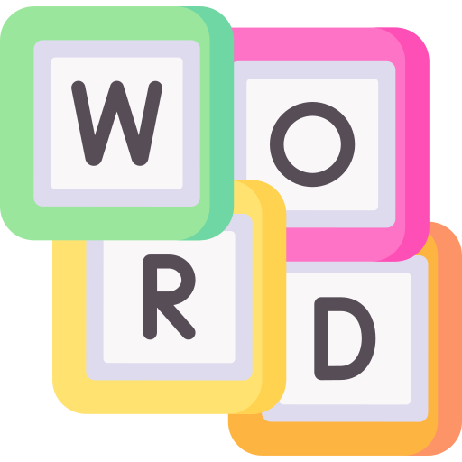
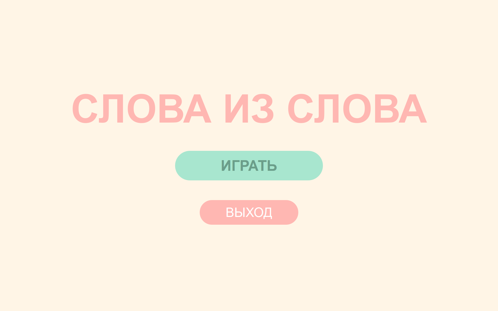
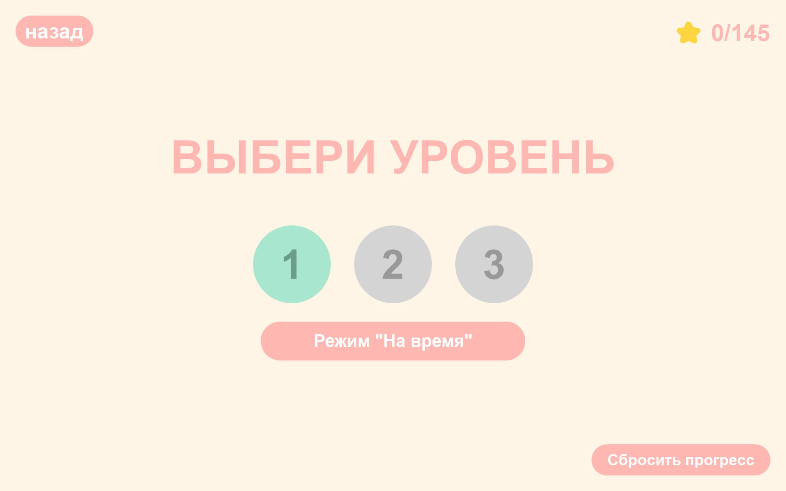
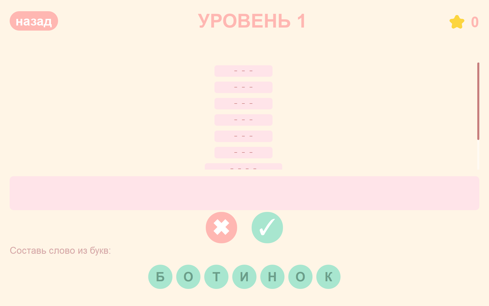
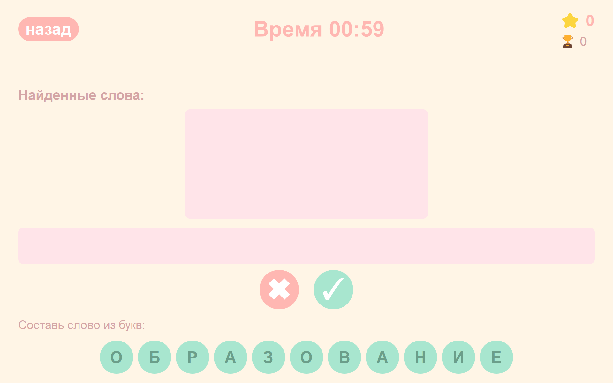

#  СЛОВА ИЗ СЛОВА

### Игра для составления слов из заданных букв. Учебный проект на PyQt5.

<br clear="both">

## Скриншоты

<!-- Добавьте скриншоты вашей игры -->





##   Особенности


-  3 уровня сложности с разными словами
-  Режим "На время" с рекордами
-  Автосохранение прогресса
-  Адаптивный интерфейс под любой экран
-  Управление мышью, закрытие по ESC

##   Правила игры

1. Вам дано исходное слово
2. Из букв этого слова нужно составлять другие слова
3. Слова должны быть именами существительными, нарицательными, в единственном числе и именительном падеже
4. Нажимайте на буквы, чтобы собрать слово
5. Нажмите ✓ для проверки слова
6. За каждое отгаданное слово вы получаете количество очков, равное числу букв

##   Установка и запуск

### Требования
- Python 3.7 или выше
- PyQt5

### Установка

```bash
# Клонируйте репозиторий
git clone https://github.com/barbarinapolina-design/Game.git

# Перейдите в папку проекта
cd Game

# Установите зависимости
pip install PyQt5
```

### Запуск
python main.py

## Сборка .exe (Windows)
### Шаг 1 - Установка PyInstaller
pip install pyinstaller

### Шаг 2 - Сборка .exe файла
pyinstaller --onefile --windowed --add-data "images;images" --icon=images/word.ico -n "Слова из слова" main.py